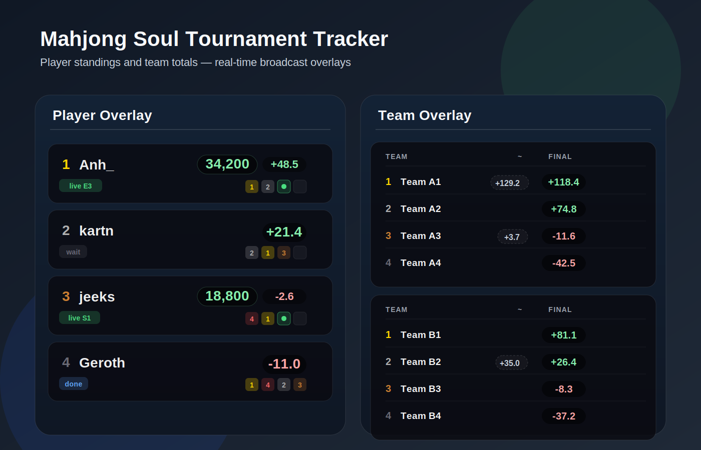

# Mahjong Soul Tournament Tracker



Mock overlay preview used for documentation.

Small FastAPI app for tracking Mahjong Soul contest results and rendering broadcast-friendly overlays.

It serves three main views:
- `Player overlay` for per-player standings.
- `Team overlay` for team totals, including provisional live values.
- `Cycle overlay` that alternates between the player and team views.

## Highlights

- Historical backfill from a chosen tracking start time.
- Live Majsoul polling with deferred finalization until a game is no longer live.
- Separate player and team configs loaded in parallel.
- Team configs can include extra players for substitutes.
- Mock preview pages for layout checks before going live.

## Run locally

```bash
python3 -m venv .venv
./.venv/bin/pip install -r requirements.txt
./.venv/bin/python -m src.server
```

Then open:
- `http://localhost:8765/admin`

Use the admin page to log in and choose the tracking start time.

## Overlay URLs

- Player tracker: `http://localhost:8765/overlay/`
- Team tracker: `http://localhost:8765/overlay/team.html`
- Alternating tracker: `http://localhost:8765/overlay/cycle.html`

Mock preview pages:
- Player preview: `http://localhost:8765/overlay/player_preview.html`
- Team preview: `http://localhost:8765/overlay/team_preview.html`
- Cycle preview: `http://localhost:8765/overlay/cycle_preview.html`

## Config files

- `config.yaml`
  Player tracker config.
- `config.semifinals.yaml`
  Team tracker config.

By default the server loads both files at the same time:
- `config.yaml` feeds the player overlay.
- `config.semifinals.yaml` feeds the team overlay.

Team rosters can contain more than 4 entries when a club uses a substitute. That lets the team tracker count results from the replacement player without changing the team aggregation logic.

## How scoring works

Each finished game is converted into an adjusted score:

```text
(raw_score - starting_points) / 1000 + uma [+ oka for 1st]
```

For teams, the displayed total is the sum of the adjusted scores of every tracked player on that team.

The team overlay also shows a provisional live value:
- `Final score` only updates after a game is no longer reported live.
- `Provisional score` uses the current live placement and score for players still in a game.

## Project structure

- `src/`
  FastAPI server, Majsoul client, and tracker logic.
- `overlay/`
  HTML, CSS, and JS for the player, team, and cycle overlays.
- `tests/`
  Regression coverage for scoring, historical backfill, and parallel config loading.
